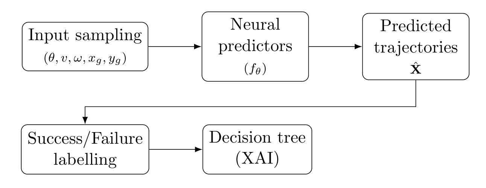
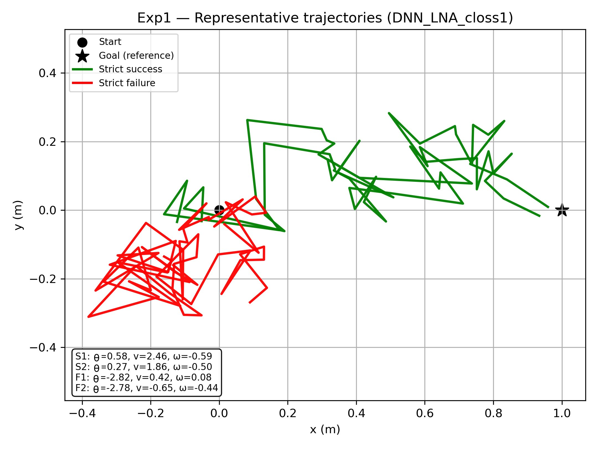
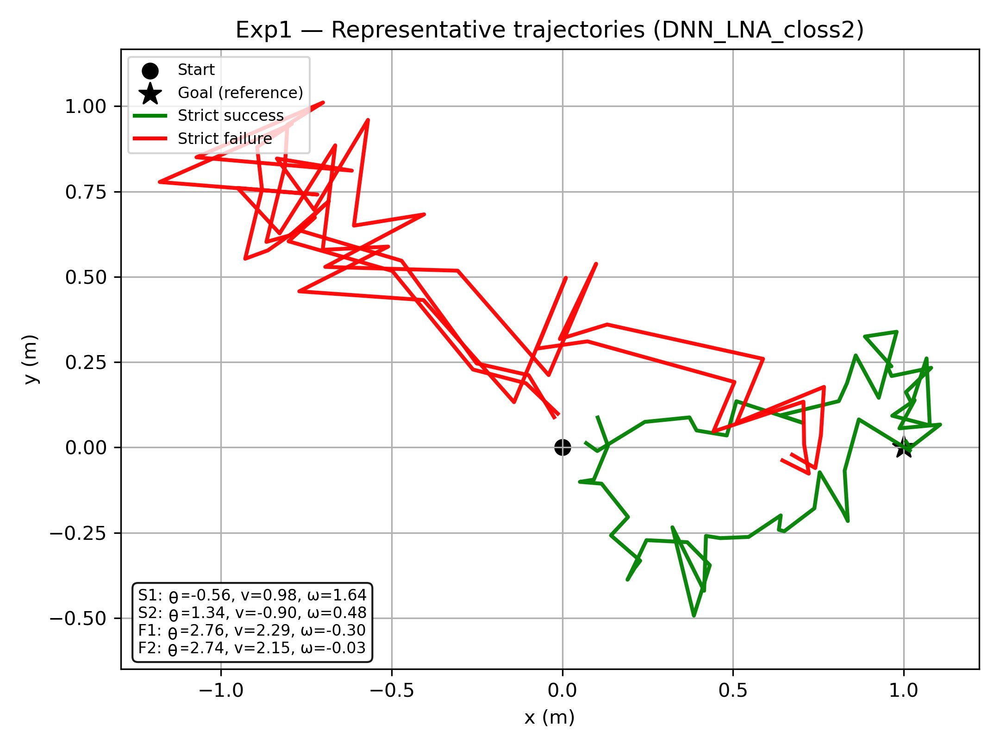
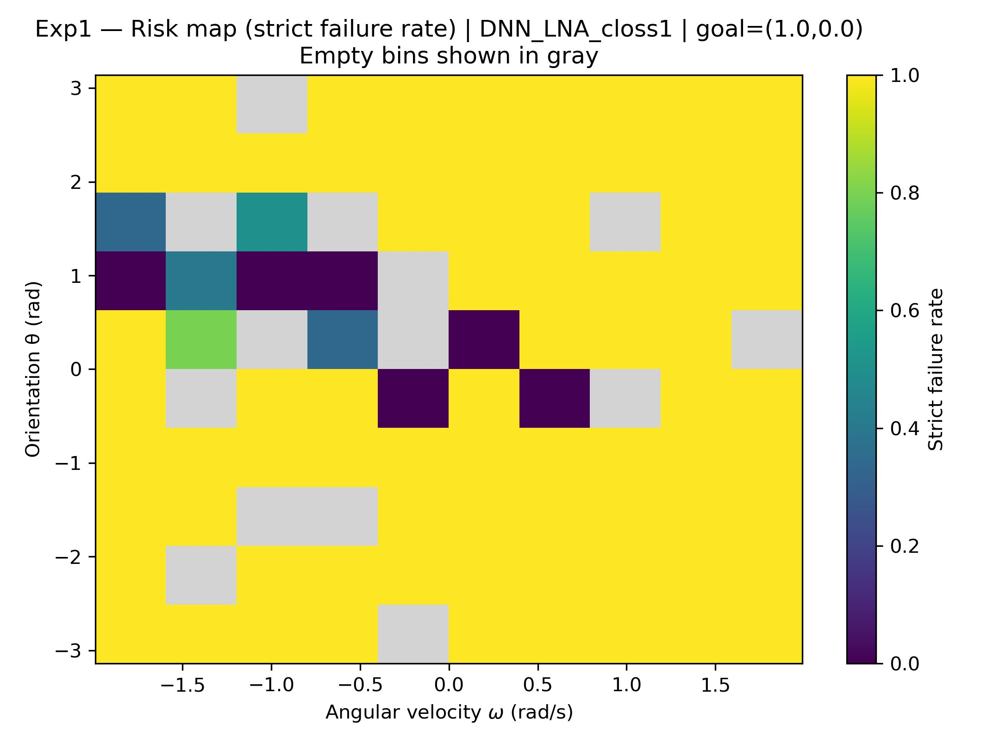
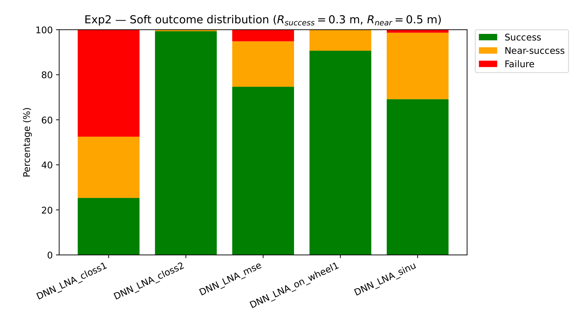

# SafeTraj-Experiments

**Trajectory-level reliability and failure analysis of pretrained neural trajectory predictors for smart wheelchair navigation**

[](https://www.python.org/)
[](https://www.tensorflow.org/)
[](https://scikit-learn.org/)
[](LICENSE)
[](https://rexasi-pro.spindoxlabs.com/)
[](https://colab.research.google.com/github/pouyapd/SafeTraj-Experiments/blob/main/notebooks/demo_analysis.ipynb)

Research artifact accompanying the MSc thesis

> **Analysis of Neural Trajectory Prediction for Collision Avoidance in Smart Wheelchairs**
> Pouya Bathaei Pourmand — DIBRIS, University of Genoa, July 2026
> Supervisors: Prof. Luca Oneto, Prof. Maurizio Mongelli · Co-supervisor: Dr. Sara Narteni
> Carried out in collaboration with CNR within the EU Horizon Europe project [REXASI-PRO](https://rexasi-pro.spindoxlabs.com/)

> [!IMPORTANT]
> The five DNN-LNA models analysed in this work are **proprietary assets of the REXASI-PRO project and are not included** in this repository. The repository publishes the evaluation code, the derived results (tables, figures, extracted decision trees) and a synthetic-data demonstration notebook. See [Reproducibility](#reproducibility) for what can and cannot be re-run.

---

## Contents

- [Overview](#overview)
- [Research Questions](#research-questions)
- [Methodology](#methodology)
- [Models](#models)
- [Experimental Design](#experimental-design)
- [Results](#results)
- [Key Findings](#key-findings)
- [Explainability](#explainability)
- [Practical Implications](#practical-implications)
- [Reproducibility](#reproducibility)
- [Repository Structure](#repository-structure)
- [Getting Started](#getting-started)
- [Demo Notebook](#demo-notebook)
- [Limitations](#limitations)
- [Future Work](#future-work)
- [Citation](#citation)
- [License](#license)

---

## Overview

Smart wheelchairs increasingly rely on learning-based models that transform user commands into motion trajectories. Such neural trajectory predictors approximate the command-to-trajectory mapping implicitly from demonstrations, rather than through an explicit kinematic model, so their behaviour can vary significantly with the initial orientation, the velocity commands, or the target position — potentially producing unsafe or inefficient motion. In a safety-critical assistive setting, an average performance figure is not sufficient: what matters is *under which conditions* a predictor fails.

This repository accompanies an MSc thesis that evaluates five pretrained **DNN-LNA** (Deep Neural Network-based Local Navigation Approach) trajectory predictors developed within the EU Horizon Europe project REXASI-PRO. The models are treated strictly as **black-box predictors**: they are not retrained, and neither their architectures nor their weights are modified. The thesis develops a model-agnostic, trajectory-level evaluation framework that samples the operational command space uniformly, labels each predicted trajectory with strict and soft success criteria, maps empirical failure rates across the command space, and fits shallow decision-tree surrogates that turn the observed failure regions into explicit, human-readable rules.

> **Central research question:** *When and why do neural trajectory predictors fail?*

---

## Research Questions

The thesis addresses two high-level problems:

1. **Failure characterisation.** Which combinations of input commands cause a pretrained neural trajectory predictor to fail to reach the intended goal, and what is the structure of these failure regions in the command space?
2. **Effect of the training objective.** How does the choice of training loss function affect the reliability of the different DNN-LNA models across a range of operational conditions and goal configurations?

Both questions are answered from predicted trajectories alone, without access to model internals.

---

## Methodology

<p align="center">
   pretrained neural predictors -> predicted trajectories -> success/failure labelling -> decision tree (XAI)" width="620">
</p>
<p align="center"><em>Overall pipeline (thesis Fig. 3.1). Inputs are sampled uniformly, fed to each pretrained model, and the resulting trajectories are labelled and analysed; a decision tree is fitted per model to extract interpretable failure rules.</em></p>

1. **Sample the operational input space.** Command inputs (θ, v, ω) are drawn by uniform random sampling over their admissible ranges. Uniform sampling is preferred over a structured grid to avoid aliasing at grid boundaries and to cover both typical and extreme configurations.
2. **Query the pretrained predictors.** Each of the five models is queried with every sampled input for each goal configuration. The occupancy map input is set to zero everywhere (obstacle-free workspace).
3. **Generate trajectories.** Each query returns a predicted trajectory of `T = 30` planar poses with the corresponding linear and angular speeds, at `Δt = 0.1 s` (3 s horizon).
4. **Compute the final goal distance.** `d = sqrt((x̂_T − x_g)² + (ŷ_T − y_g)²)`, the Euclidean distance between the trajectory endpoint and the goal.
5. **Assign strict and soft outcomes.** Strict: *Success* if `d < 0.30 m`. Soft: *Success* (`d < 0.30 m`), *Near-success* (`0.30 ≤ d < 0.50 m`), *Failure* (`d ≥ 0.50 m`).
6. **Construct labelled evaluation data.** Each observation is `(θ, v, ω, GoalX, GoalY) → Success/Failure`; with `N = 200` inputs and `G = 3` goals this yields `N × G = 600` observations per model.
7. **Fit decision-tree surrogates.** One shallow `DecisionTreeClassifier` per model (`max_depth = 4`, `min_samples_leaf = 10`, Gini criterion) on the 600 labelled observations; training accuracy is reported as a consistency check between tree rules and observed outcomes.
8. **Analyse risk regions and model differences.** Empirical risk maps (failure rate per (θ, ω) bin), per-goal strict success rates, average final distances, soft-outcome distributions and the extracted rules are compared across the five models.

The empirical risk of an input bin `U_b` is the fraction of its samples that fail the strict threshold:

```
R(U_b) = (1 / N_b) · Σ_{j : (θ_j, ω_j) ∈ U_b}  1[ d_j ≥ 0.30 m ]
```

---

## Models

Five pretrained DNN-LNA predictors are evaluated. They were developed and trained by the REXASI-PRO project partners (DFKI); the training procedure, dataset preparation and network design are documented in project deliverable D3.2 and are **not** part of this work.

| Model | Role in this study |
|---|---|
| `DNN_LNA_closs1` | Lowest strict success rate in the evaluation (25.3 %) |
| `DNN_LNA_closs2` | Highest strict success rate in the evaluation (99.3 %) |
| `DNN_LNA_mse` | Intermediate (74.7 %); characterised in the thesis as trained with a mean-squared-error criterion on trajectory poses |
| `DNN_LNA_on_wheel1` | Intermediate (90.7 %) |
| `DNN_LNA_sinu` | Intermediate (69.2 %) |

What is known from the thesis: the models differ in loss functions, number of layers and input parametrisation, but share a common interface. The individual loss definitions and architectural details are documented in deliverable D3.2 and are not reproduced here.

**Interface (as used by the evaluation code).**

| | Content | Shape (batch of N) |
|---|---|---|
| Input | command vector `(θ, v, ω)` | `(N, 3)` |
| Input | goal vector `(x_g, y_g, 0, 0, 0)` | `(N, 5)` |
| Input | occupancy map (all zeros in this study) | `(N, 300, 300, 1)` |
| Output | trajectory `(x̂_t, ŷ_t, θ̂_t, v̂_t, ω̂_t)` for `t = 1 … 30` | `(N, 5, 30)` |

Trajectories are expressed in a robot-centric frame attached to the initial pose (start at the origin, initial heading aligned with the x-axis).

> The models are used as **fixed, pretrained black boxes**. No retraining, fine-tuning, or architectural modification was performed.

---

## Experimental Design

| Condition | Value |
|---|---|
| Models | 5 pretrained DNN-LNA predictors (black-box) |
| Initial orientation θ | `[−π, π]` rad |
| Linear velocity v | `[−1.05, 2.88]` m/s (reverse and forward motion) |
| Angular velocity ω | `[−1.99, 1.99]` rad/s |
| Sampling | `N = 200` inputs, uniform random sampling; the same inputs are reused for every goal |
| Occupancy map | zero everywhere (obstacle-free workspace) |
| Prediction horizon | `T = 30` steps, `Δt = 0.1 s` (3 s) |
| Goal configurations (`G = 3`) | A — near lateral `(0.5, 0.5)` · B — straight ahead `(1.0, 0.0)` · C — far off-axis `(1.5, −0.5)` |
| Strict success | `d < 0.30 m` (grounded in the physical tolerances of the Rolland platform) |
| Soft success | Success `d < 0.30` · Near-success `0.30 ≤ d < 0.50` · Failure `d ≥ 0.50` m |
| Labelled observations | `N × G = 600` per model (200 per model–goal cell) |
| Decision tree | features `(θ, v, ω, GoalX, GoalY)`; `max_depth = 4`; `min_samples_leaf = 10`; Gini |

**Experiment 1 — Input-Space Sensitivity Analysis.** Characterises how predicted trajectories vary across the command space (θ, v, ω) for the reference goal `(1.0, 0.0)`, and identifies the input regions that trigger failure via representative trajectories, empirical risk maps and decision-tree rules.

**Experiment 2 — Goal-Based Difficulty Analysis.** Re-evaluates the same 200 inputs across the three goal configurations to study goal-dependent behaviour, using strict success rates, average final distance to goal and the soft-outcome distribution.

---

## Results

All values below are taken from the thesis (Chapter 4) and correspond to the result files in [`results/`](results/).

### Strict success rate per model and goal (Exp2)

`d < 0.30 m`, `N = 200` per cell, `G = 3` goals; *Overall* is the mean across goals. (Thesis Table 4.1 · image: [`results/figures/table_success_rate.png`](results/figures/table_success_rate.png))

| Model | Goal A (0.5, 0.5) | Goal B (1.0, 0.0) | Goal C (1.5, −0.5) | **Overall** | Rank |
|---|:---:|:---:|:---:|:---:|:---:|
| `DNN_LNA_closs1` | 50.5 % | 10.5 % | 15.0 % | **25.3 %** | 5 |
| `DNN_LNA_closs2` | 100.0 % | 98.0 % | 100.0 % | **99.3 %** | 1 |
| `DNN_LNA_mse` | 83.5 % | 76.5 % | 64.0 % | **74.7 %** | 3 |
| `DNN_LNA_on_wheel1` | 91.0 % | 88.0 % | 93.0 % | **90.7 %** | 2 |
| `DNN_LNA_sinu` | 79.5 % | 64.5 % | 63.5 % | **69.2 %** | 4 |

### Average final distance to goal (m)

Lower is better. (Thesis Table 4.2 · image: [`results/figures/table_avg_distance.png`](results/figures/table_avg_distance.png))

| Model | Goal A | Goal B | Goal C | **Overall avg** |
|---|:---:|:---:|:---:|:---:|
| `DNN_LNA_closs1` | 0.305 | 0.603 | 0.538 | **0.482** |
| `DNN_LNA_closs2` | 0.123 | 0.137 | 0.129 | **0.130** |
| `DNN_LNA_mse` | 0.200 | 0.228 | 0.283 | **0.237** |
| `DNN_LNA_on_wheel1` | 0.188 | 0.190 | 0.150 | **0.176** |
| `DNN_LNA_sinu` | 0.216 | 0.261 | 0.255 | **0.244** |

Even among trajectories that miss the strict threshold, `DNN_LNA_closs2` ends on average only 0.130 m from the goal versus 0.482 m for `DNN_LNA_closs1` — qualitatively different failure modes (near-miss versus divergence).

### Experiment 1 — where failures occur

<p align="center">
  
  
</p>
<p align="center"><em>Representative trajectories for the worst- and best-performing models at the reference goal (1.0, 0.0) (thesis Figs. 4.1–4.2). Green: strict success (d &lt; 0.30 m); red: failure. For <code>DNN_LNA_closs1</code>, failures are predominantly associated with initial orientations near θ ≈ ±π, i.e. the wheelchair starting with its back to the goal.</em></p>

<p align="center">
  
</p>
<p align="center"><em>Risk map for <code>DNN_LNA_closs1</code> (thesis Fig. 4.3): high failure rates concentrate in the bands θ ≈ ±π and persist across the full range of ω, while |θ| &lt; 1.5 rad shows consistently lower failure rates. Gray bins are sparsely sampled.</em></p>

<p align="center">
  
</p>
<p align="center"><em>Supplementary view from the repository results: orientation × linear velocity × final distance for <code>DNN_LNA_on_wheel1</code> at goal (1.0, 0.0); the gray plane is the 0.30 m threshold.</em></p>

### Experiment 2 — soft outcomes

<p align="center">
  
</p>
<p align="center"><em>Soft outcome distribution aggregated over all goals (thesis Fig. 4.6; d_success = 0.30 m, d_near = 0.50 m). <code>DNN_LNA_closs2</code> is almost entirely Success; <code>DNN_LNA_closs1</code> is dominated by Failure with a small Near-success band; <code>DNN_LNA_mse</code> and <code>DNN_LNA_sinu</code> show a visible Near-success band.</em></p>

### Decision-tree surrogates

| Model | Success / Failure (of 600) | Nodes (internal / leaves) | Train accuracy | Root split |
|---|:---:|:---:|:---:|---|
| `DNN_LNA_closs2` | 596 / 4 | 5 (2 / 3) | 0.99 | `θ ≤ 2.27 rad` |
| `DNN_LNA_on_wheel1` | 544 / 56 | 19 (9 / 10) | 0.94 | `θ ≤ −2.83 rad` |
| `DNN_LNA_mse` | 448 / 152 | 27 (13 / 14) | 0.88 | `ω ≤ 1.42 rad/s` |
| `DNN_LNA_sinu` | 415 / 185 | 25 (12 / 13) | 0.85 | `v ≤ −0.68 m/s` |
| `DNN_LNA_closs1` | 152 / 448 | 27 (13 / 14) | 0.90 | `GoalX ≤ 0.75 m` |

Extracted rules for the two extreme models (thesis §4.2.4):

- **`DNN_LNA_closs2`** — all three leaves predict Success. `θ ≤ 2.27 rad → Success` (480 samples, 100 %); `θ > 2.27 ∧ v ≤ 1.78 m/s → Success` (97 samples, 97 %); `θ > 2.27 ∧ v > 1.78 m/s → Success` (23 samples, 87 %). The only risk-adjacent region is a near-backward orientation combined with high forward speed.
- **`DNN_LNA_closs1`** — `GoalX ≤ 0.75 m → Failure`; `GoalX > 0.75 ∧ θ ≤ −2.36 rad → Failure`; `GoalX > 0.75 ∧ θ > −2.36 ∧ v ≤ 0.58 m/s → Failure`; `GoalX > 0.75 ∧ −2.36 < θ ≤ 1.80 rad ∧ v > 0.58 m/s → Success`. Success requires a forward-facing orientation *and* sufficient speed, and near-lateral goals fail almost regardless of the command.

---

## Key Findings

Within the evaluated model family (five pretrained DNN-LNA predictors) and the experimental conditions above:

| # | Finding | Evidence |
|---|---|---|
| 1 | **Failures are structured, not random.** They concentrate in identifiable regions of the command space. | Risk-map bands at θ ≈ ±π; tree rules with training accuracy 0.85–0.99; risk maps, success tables and rules agree on the same zones |
| 2 | **Initial orientation θ is the primary failure trigger.** For most models the first or second tree split is on θ, particularly around ±π. | `DNN_LNA_closs1` risk map; `DNN_LNA_on_wheel1` failure leaves at extreme orientations; the single `DNN_LNA_closs2` split at θ = 2.27 rad |
| 3 | **Reliability differs by 74 percentage points** between models that share the same interface and were evaluated under identical conditions. | Strict success 99.3 % (`closs2`) → 90.7 % → 74.7 % → 69.2 % → 25.3 % (`closs1`) |
| 4 | **Each model has a distinct, interpretable failure mechanism.** | Root splits on `GoalX` (`closs1`), ω (`mse`), v < −0.68 m/s i.e. backward motion (`sinu`), θ (`closs2`, `on_wheel1`) |
| 5 | **Tree complexity is inversely related to robustness.** | 5 nodes at 99.3 %, 19 at 90.7 %, 27 at 74.7 %, 25 at 69.2 %, 27 at 25.3 % |
| 6 | **Failure severity differs qualitatively.** | Average final distance 0.130 m (`closs2`) vs 0.482 m (`closs1`); near-miss vs divergence in the soft-outcome distribution |
| 7 | **`DNN_LNA_closs1` fails systematically for near-lateral goals.** | Rule `GoalX ≤ 0.75 m → Failure`; per-goal success 50.5 / 10.5 / 15.0 % |
| 8 | **The extracted rules are directly actionable** as pre-execution checks on the command vector. | e.g. flag θ > 2.27 rad with v > 1.78 m/s for `closs2`; the four-rule corridor for `closs1` |

On the training objective: the thesis argues that, because all five models were evaluated under identical conditions, the large reliability gap cannot be attributed to input coverage or evaluation methodology, and concludes that **within this controlled comparison the choice of training loss function is the dominant factor determining robustness**. This is a conclusion about the evaluated DNN-LNA family, not a general claim about neural trajectory predictors, and the individual loss definitions are documented only in the project deliverable.

---

## Explainability

Risk maps and aggregate statistics give a global view of model behaviour but do not express explicit conditions. To obtain human-readable rules, one **shallow decision tree** (`max_depth = 4`, `min_samples_leaf = 10`, Gini) is fitted per model on the 600 labelled observations, with features `(θ, v, ω, GoalX, GoalY)` and the strict Success/Failure label as target. Shallow trees were chosen because they (i) produce explicit if-then rules that can be used directly for run-time command filtering or fallback planning, (ii) can be inspected by a human operator without an additional explanation layer, and (iii) reveal the primary drivers of failure through the choice of root and internal splits. Training accuracy is reported as a consistency check; the trees are surrogates of the true failure boundary, not exact characterisations.

<p align="center">
  
</p>
<p align="center"><em>Decision tree for <code>DNN_LNA_closs2</code> (N = 600, train accuracy 0.99, threshold 0.30 m; thesis Fig. 4.4). Blue nodes: predicted Success; orange nodes: predicted Failure.</em></p>

<p align="center">
  
</p>
<p align="center"><em>Decision tree for <code>DNN_LNA_closs1</code> (N = 600, train accuracy 0.90; thesis Fig. 4.5). The root splits on <code>GoalX</code>, and most leaves predict Failure.</em></p>

Trees for the remaining models: [`tree_DNN_LNA_mse.png`](results/figures/tree_DNN_LNA_mse.png) · [`tree_DNN_LNA_on_wheel1.png`](results/figures/tree_DNN_LNA_on_wheel1.png) · [`tree_DNN_LNA_sinu.png`](results/figures/tree_DNN_LNA_sinu.png). In the plots the orientation feature is labelled ϕ; it is the same quantity denoted θ in the text.

---

## Practical Implications

The consistency between risk maps, success-rate tables and decision-tree rules implies that failure-prone inputs can be recognised **from the command vector alone, before trajectory execution**. The thesis derives three collision-avoidance applications from this:

- **Dynamic command filtering** — commands in high-risk regions (e.g. θ > 2.27 rad with v > 1.78 m/s for `DNN_LNA_closs2`, or outside the narrow success corridor of `DNN_LNA_closs1`) could be scaled or redirected before execution.
- **Hybrid navigation fallback** — when the current goal lies in a historically high-failure region, the system could switch from the neural predictor to a conservative model-based planner.
- **Predictive failure monitoring** — the strict/soft distinction and the average-distance metric could support run-time monitoring of navigation confidence, with drift into the Near-success zone triggering haptic or visual feedback.

> [!NOTE]
> **What was demonstrated vs. what is proposed.** The experiments demonstrate, offline, that failure regions are structured and can be described by explicit rules extracted from the command vector. The three applications above are **proposed uses** of those rules; no real-time filter, fallback controller or monitoring system was implemented or deployed on a wheelchair in this work, and no formal safety guarantee is claimed.

---

## Reproducibility

**What is publicly reproducible from this repository**

- The complete evaluation pipeline for Experiments 1 and 2 (`src/`): input sampling with a fixed seed, batched inference against the DNN-LNA SavedModel interface, final-distance computation, strict/soft labelling, and figure generation.
- All derived results of the thesis experiments: per-model/per-goal tables, extracted decision trees for the five models, and result figures (`results/`).
- A synthetic-data demonstration of the full methodology, runnable without any proprietary asset (`notebooks/demo_analysis.ipynb`).

**What is not**

- **The DNN-LNA model weights.** They are proprietary assets of the REXASI-PRO project. Without them, `src/evaluate.py` cannot regenerate the raw trajectories; the numbers in `results/` cannot be recomputed from scratch, only inspected.
- The decision-tree fitting step applied to the real outputs. The trees in `results/figures/` were fitted with scikit-learn (`max_depth = 4`, `min_samples_leaf = 10`, Gini) on the 600 labelled observations per model; the notebook shows the identical procedure on synthetic data.

**Software stack used by the repository code:** Python ≥ 3.9 · TensorFlow ≥ 2.12 (the models are distributed as TensorFlow SavedModels) · NumPy · pandas · Matplotlib · seaborn · scikit-learn. Random seed `42` (`src/config.py`). Result files are written to structured directories (`results/tables`, `results/figures_exp1`, `results/figures_exp2`) so that each stage can be inspected independently.

**Provenance of `results/`**

- `results/figures/table_success_rate.png` and `table_avg_distance.png` are thesis Tables 4.1 and 4.2; `results/figures/tree_*.png` are thesis Figs. 4.4, 4.5 and A.1–A.3.
- `results/tables/combined_overview.csv` (column `Exp1`) and `exp1_input_sensitivity_goal_1_0.csv` contain the overall and goal-B strict success rates and average distances reported in the thesis; `exp1_failure_distance_summary.csv`, `exp1_theta_sensitivity.csv`, `exp1_bad_theta_bins.csv` and `summary_table.csv` (success rate as a function of the distance threshold) are further per-run outputs.
- `results/extracted_rules.txt` and `results/feature_importances.txt` come from an **earlier exploratory tree (depth 8, features θ, v, ω only)** and do not correspond to the depth-4 trees reported in the thesis.
- Figures under `results/figures_exp1/` and `results/figures_exp2/` are raw outputs of the evaluation runs; those not referenced in this README are provided as-is for inspection.

---

## Repository Structure

```text
SafeTraj-Experiments/
├── docs/
│   └── figures/                    # thesis figures reproduced in this README
│       ├── pipeline.png            # methodology pipeline (thesis Fig. 3.1)
│       ├── trajectories_closs1.png # representative trajectories (Fig. 4.1)
│       ├── trajectories_closs2.png # representative trajectories (Fig. 4.2)
│       ├── risk_map_closs1.png     # empirical risk map (Fig. 4.3)
│       └── soft_outcome_distribution.png   # soft outcomes (Fig. 4.6)
├── notebooks/
│   └── demo_analysis.ipynb         # synthetic-data demonstration of the methodology
├── src/
│   ├── config.py                   # seed, model names, input ranges, goals, thresholds, paths
│   ├── model_utils.py              # SavedModel loading, batched inference, final-distance computation
│   └── evaluate.py                 # Experiment 1 + Experiment 2 pipeline and figure generation
├── results/
│   ├── figures/                    # thesis tables (PNG) and decision trees for all five models
│   ├── figures_exp1/               # Experiment 1 figures
│   ├── figures_exp2/               # Experiment 2 figures
│   ├── tables/                     # CSV outputs of the evaluation runs
│   ├── extracted_rules.txt         # earlier exploratory depth-8 tree (see Provenance)
│   └── feature_importances.txt     # earlier exploratory depth-8 tree (see Provenance)
├── requirements.txt
├── LICENSE
└── README.md
```

---

## Getting Started

```bash
git clone https://github.com/pouyapd/SafeTraj-Experiments.git
cd SafeTraj-Experiments
pip install -r requirements.txt
```

**Running the evaluation pipeline** requires access to the DNN-LNA models. `src/model_utils.py` expects one TensorFlow SavedModel per model at `<model_root>/<MODEL_NAME>/DNN_LNA_model/`, exposing a `serving_default` signature with inputs `input_1` (occupancy map), `input_2` (θ, v, ω) and `input_3` (goal vector) and returning a `(N, 5, 30)` or `(N, 30, 5)` trajectory tensor. Then:

```bash
python src/evaluate.py --model_root /path/to/models --output_dir results
```

This samples `N = 200` inputs (seed 42), runs both experiments for the five models and three goals, and writes `exp1_inputs.npy`, `exp1_samples.csv`, `exp2_goal_summary.csv` and the Exp1/Exp2 figures under `--output_dir`. Model names, input ranges, goals and thresholds are set in `src/config.py`.

**Without the models**, use the demonstration notebook below or inspect the published results in `results/`.

---

## Demo Notebook

[`notebooks/demo_analysis.ipynb`](notebooks/demo_analysis.ipynb) — [](https://colab.research.google.com/github/pouyapd/SafeTraj-Experiments/blob/main/notebooks/demo_analysis.ipynb)

The notebook walks through the methodology end-to-end **on synthetic data** and requires no proprietary model or dataset. Specifically:

| Section | What it does | Data source |
|---|---|---|
| Synthetic data generation | Samples (θ, v, ω) over the thesis operational ranges and goals from {0.5, 1.0, 1.5} × {0.5, 0.0, −0.5}; assigns synthetic final distances that mimic the qualitative patterns reported in the thesis (higher failure near θ ≈ ±π, added risk at high \|ω\|, harder distant goals) | **Synthetic** |
| Exp1 — input sensitivity | Scatter plots of each input against final distance with the 0.30 m threshold; binned (θ, ω) risk map | Synthetic |
| Exp2 — model comparison | Stacked Success / Near-success / Failure bars and a ranking table for the five models | Strict success rates are the **thesis values** (25.3 / 99.3 / 74.7 / 90.7 / 69.2 %) entered as constants; the near-success/failure splits are illustrative |
| Explainability | Fits a `DecisionTreeClassifier` (`max_depth = 4`) on `(GoalX, GoalY, θ, v, ω)` and plots it | Synthetic — the reported accuracy is for demonstration only |
| Summary | Prints the key findings | Thesis findings, restated |

The notebook therefore illustrates *how* the analysis is performed; the *actual* experimental results are those in `results/` and in the thesis.

---

## Limitations

- **Black-box evaluation.** The models were evaluated as fixed black-box predictors. Internal representations, weights and layer-level activations were not analysed, so the root causes of failure inside the networks remain partially opaque.
- **Offline setting.** All analysis is offline on uniformly sampled inputs in an obstacle-free workspace. Moving obstacles, floor friction, sensor noise and real user command distributions were not modelled; the sampled inputs may not represent the command distribution of real deployment.
- **Limited model and goal coverage.** Five models, `N = 200` inputs per goal and `G = 3` goals — sufficient to identify systematic trends, but a larger and more diverse sample would strengthen generalisability.
- **Fixed success threshold.** The strict criterion `d < 0.30 m` was fixed throughout; results could differ under alternative thresholds.
- **Decision trees as surrogates.** With `max_depth = 4` the trees cannot capture all interaction effects and may misclassify inputs near the true boundary (training accuracies 0.85–0.99). The rules are derived from the same data used for evaluation; the thesis relies on their agreement with the independently computed risk maps and success tables as evidence that the patterns are genuine.
- **Dependence on proprietary assets.** The raw experiments cannot be re-run without the DNN-LNA weights.

---

## Future Work

Directions identified in the thesis:

- **Real-time collision-avoidance filtering** — integrating the risk maps and decision-tree rules into a live control loop to filter high-risk user commands before execution.
- **Hybrid navigation fallback** — a switching mechanism that reverts to a classical model-based planner when a command falls in a known failure region or the predictor signals low confidence.
- **Advanced explainability** — extending the decision-tree analysis with feature-attribution methods such as SHAP or LIME to capture interaction effects a single tree cannot.
- **On-platform validation** — physical testing on the smart wheelchair platform to confirm that the identified risk zones and extracted rules generalise to real sensor and actuator conditions.
- **Adaptive threshold selection** — adapting the success threshold to the environment or user profile and studying how risk maps and tree boundaries shift with it.

---

## Citation

```bibtex
@mastersthesis{bathaeipourmand2026safetraj,
  author  = {Bathaei Pourmand, Pouya},
  title   = {Analysis of Neural Trajectory Prediction for Collision Avoidance in Smart Wheelchairs},
  school  = {DIBRIS, University of Genoa},
  year    = {2026},
  month   = jul,
  note    = {MSc thesis. Supervisors: L. Oneto, M. Mongelli; co-supervisor: S. Narteni. Carried out within the EU Horizon Europe project REXASI-PRO (Grant Agreement No. 101070028-2)}
}
```

The DNN-LNA models are described in: Z. Duan, S. Autexier, J. Janssen, C. Mandel, *TensorFlow model description for DNN-LNA*, REXASI-PRO Project Deliverable D3.2, DFKI, 2024.

---

## License

The code, figures and result files in this repository are released under the [MIT License](LICENSE).

The DNN-LNA models (weights, architectures and training data) remain proprietary assets of the REXASI-PRO project and its partners; they are **not** distributed with this repository and are **not** covered by this license.
