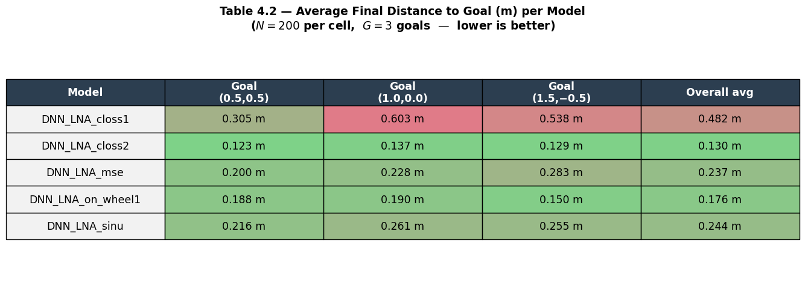
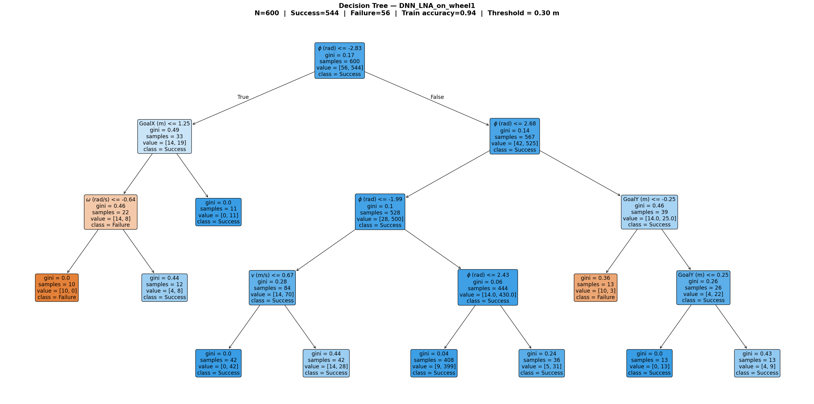
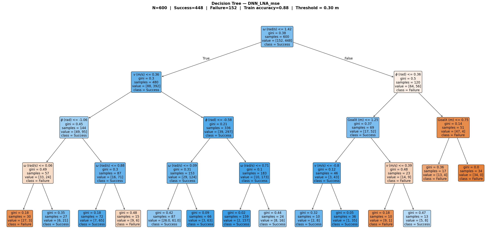
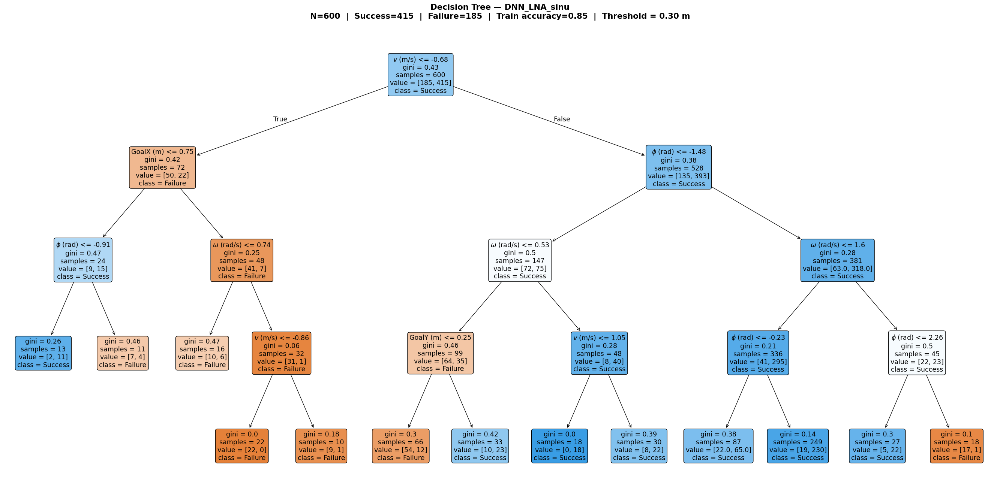
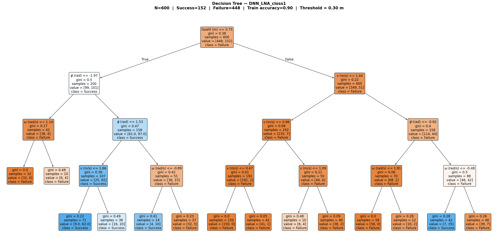

# SafeTraj-Experiments

**Trajectory-Level Evaluation of Neural Motion Prediction for Autonomous Wheelchair Navigation**

[](https://www.python.org/)
[](https://www.tensorflow.org/)
[](LICENSE)
[](https://rexasi-pro.sparn.be/)

---

**Author:** Pouya Bathaei Pourmand  
**Affiliation:** MSc in Computer Engineering (AI) — University of Genoa / CNR-IEIIT, Italy  
**Project:** [REXASI-PRO](https://rexasi-pro.sparn.be/) — Reliable & Explainable AI for Smart Mobility (EU Horizon Europe)  
**Supervisors:** Prof. Luca Oneto · Dr. Maurizio Mongelli · Dr. Sara Narteni

---

## Overview

This repository contains the public results and source code from the MSc thesis:

> **"Analysis of Neural Trajectory Prediction for Collision Avoidance in Smart Wheelchairs"**

The thesis develops a **systematic trajectory-level evaluation framework** for pretrained neural motion prediction models (DNN-LNA) used in autonomous wheelchair navigation.

The core question is: **when and why do neural trajectory predictors fail?**

All five models are treated as **black-box predictors** — evaluated purely through their outputs, without any access to weights or retraining.

> ⚠️ The DNN-LNA model weights are **not included** (proprietary, REXASI-PRO project). Only derived results, CSVs and visualisations are public.

---

## Problem Setting

Each navigation scenario is defined by three input commands:

| Symbol | Variable | Operational Range |
|--------|----------|-------------------|
| φ (theta) | Initial orientation | [−π, π] rad |
| v | Linear velocity | [−1.05, 2.88] m/s |
| ω (omega) | Angular velocity | [−1.99, 1.99] rad/s |

Given these inputs, a pretrained neural model predicts a future trajectory:

```
X̂ = f_θ(φ, v, ω) = [(x₁,y₁,θ₁), ..., (x_T, y_T, θ_T)]    T = 30 steps
```

A trajectory is evaluated using two criteria:

- **Strict success:** final distance to goal `d < 0.30 m`  
- **Soft success:** Success (`d < 0.30 m`) / Near-success (`0.30 ≤ d < 0.50 m`) / Failure (`d ≥ 0.50 m`)

---

## Experiments

### Experiment 1 — Input-Space Sensitivity Analysis

**Objective:** Identify which command regions trigger unstable or failed trajectory predictions.

**Method:** N=200 inputs sampled uniformly across (φ, v, ω). Each of the five models generates a predicted trajectory per input. Outcomes are aggregated into risk maps.

**Key findings:**
- Initial orientation φ near ±π (wheelchair facing backward) is the dominant failure trigger
- Angular velocity ω has secondary influence
- Risk is concentrated — clear *zones of exclusion* exist in the command space
- `DNN_LNA_closs1` is the most unstable; `DNN_LNA_closs2` is the most stable

---

### Experiment 2 — Goal-Based Difficulty Analysis

**Objective:** Evaluate how model performance changes across different target positions.

**Method:** Three reference goals tested across all five models with strict and soft success criteria.

| Goal | Position | Complexity |
|------|----------|------------|
| A | (0.5, 0.5) | Near lateral — low/medium |
| B | (1.0, 0.0) | Straight ahead — medium |
| C | (1.5, −0.5) | Far off-axis — high |

**Key findings:**
- Goal reachability is strongly goal-dependent
- `DNN_LNA_closs2` achieves **99.3%** strict success across all goals
- `DNN_LNA_closs1` achieves only **25.3%** strict success
- Soft success reveals near-miss cases invisible to binary metrics

---

## Model Performance Summary

**Strict Success Rate (%) — d < 0.30 m:**


**Average Final Distance to Goal (m):**



> N=200 inputs × 3 goals = 600 observations per model.

---

## Interpretability — Decision Tree Analysis

To explain *why* each model fails, a shallow decision tree (max depth 4) was fitted on the (φ, v, ω, GoalX, GoalY) → Success/Failure labels for each model. The trees reveal human-readable rules for collision-avoidance risk.

**DNN_LNA_closs2** (Rank 1 — 99.3% success): nearly all inputs succeed; the tree has only 3 leaves, all predicting Success.


**DNN_LNA_on_wheel1** (Rank 2 — 90.7% success): failures concentrate at extreme orientations φ ≈ ±π.



**DNN_LNA_mse** (Rank 3 — 74.7% success): angular velocity ω is the primary split; low v also contributes.



**DNN_LNA_sinu** (Rank 4 — 69.2% success): negative linear velocity (v < −0.68 m/s) is the root failure trigger.



**DNN_LNA_closs1** (Rank 5 — 25.3% success): goal position dominates; majority of inputs fail regardless of orientation.



---

## Practical Implications for Collision Avoidance

The identified risk regions support three concrete run-time applications:

1. **Dynamic Command Filtering** — Commands falling into high-risk regions (φ near ±π) can be proactively scaled or redirected before execution.
2. **Hybrid Navigation Fallback** — When the target lies in a high-failure region, the system switches from the neural predictor to a classical model-based planner.
3. **Predictive Failure Monitoring** — Consistent drift into the near-success zone triggers haptic or visual feedback to the user before a full navigation failure occurs.

---

## Repository Structure

```
SafeTraj-Experiments/
├── src/
│   ├── config.py           # Central configuration (ranges, goals, thresholds)
│   ├── model_utils.py      # Model loading and inference interface
│   └── evaluate.py         # Main evaluation pipeline (Exp1 + Exp2)
│
├── results/
│   ├── figures/            # Key result figures (used in README)
│   │   ├── table_success_rate.png
│   │   ├── table_avg_distance.png
│   │   ├── tree_DNN_LNA_closs1.png
│   │   ├── tree_DNN_LNA_closs2.png
│   │   ├── tree_DNN_LNA_mse.png
│   │   ├── tree_DNN_LNA_on_wheel1.png
│   │   └── tree_DNN_LNA_sinu.png
│   │
│   └── tables/             # CSV outputs (generated by evaluate.py)
│       ├── exp1_samples.csv
│       ├── exp1_theta_sensitivity.csv
│       ├── exp1_failure_distance_summary.csv
│       ├── exp2_goal_summary.csv
│       └── exp2_goal_mean_over_models.csv
│
├── requirements.txt
└── README.md
```

---

## Reproducing the Results

> The DNN-LNA model weights are not publicly available. To reproduce:
> 1. Obtain model weights from the [REXASI-PRO project](https://rexasi-pro.sparn.be/)
> 2. Place each model under `models/<model_name>/DNN_LNA_model/`
> 3. Run the pipeline:

```bash
# Install dependencies
pip install -r requirements.txt

# Run full evaluation
python src/evaluate.py --model_root /path/to/models --output_dir results/
```

---

## Related Projects

- **[SafeTraj-Prototype](https://github.com/pouyapd/SafeTraj-Prototype)** *(coming soon)* — Python toolkit for trajectory behaviour analysis and risk scoring
- Part of MSc thesis research at the **University of Genoa**, in collaboration with **CNR-IEIIT** within the **EU Horizon Europe REXASI-PRO** project

---

## Citation

If you use this work, please cite:

```bibtex
@mastersthesis{bathaei2026safetraj,
  author  = {Bathaei Pourmand, Pouya},
  title   = {Analysis of Neural Trajectory Prediction for Collision Avoidance
             in Smart Wheelchairs},
  school  = {University of Genoa, DIBRIS},
  year    = {2026},
  note    = {MSc in Computer Engineering (AI), REXASI-PRO EU Project}
}
```

---

## License

MIT — see [LICENSE](LICENSE) for details.  
Model weights are proprietary to the REXASI-PRO project and are not covered by this license.