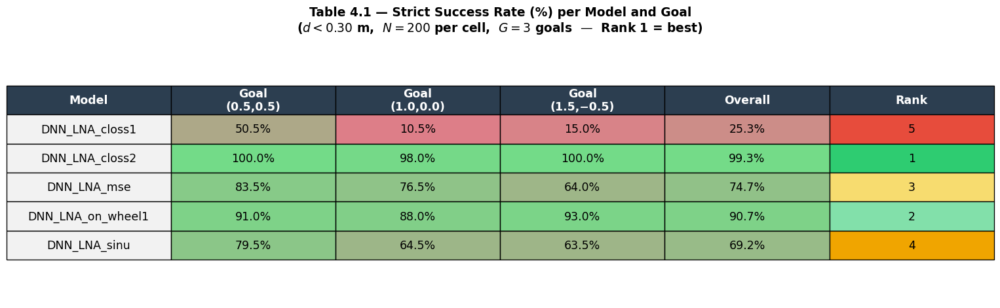
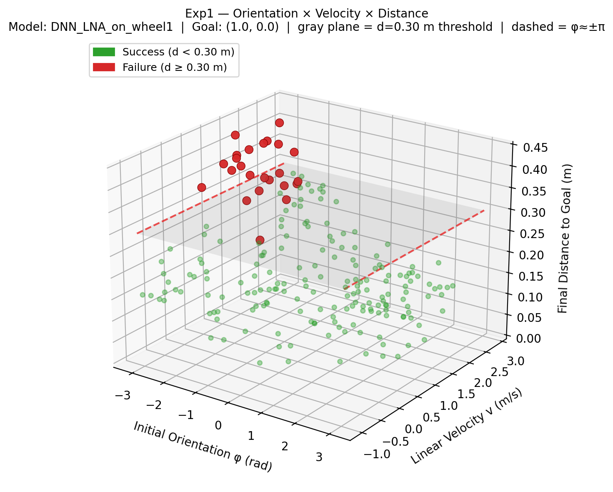
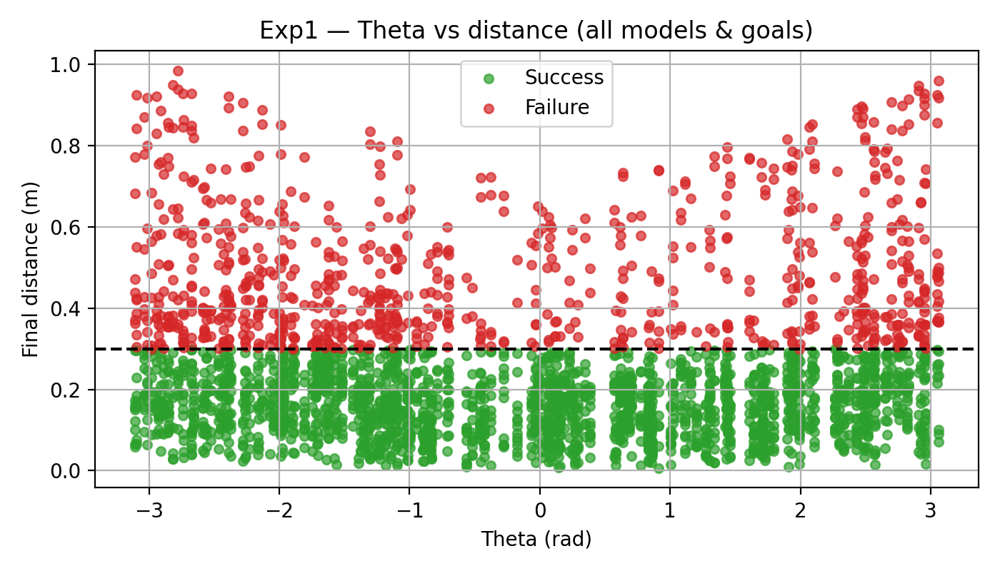
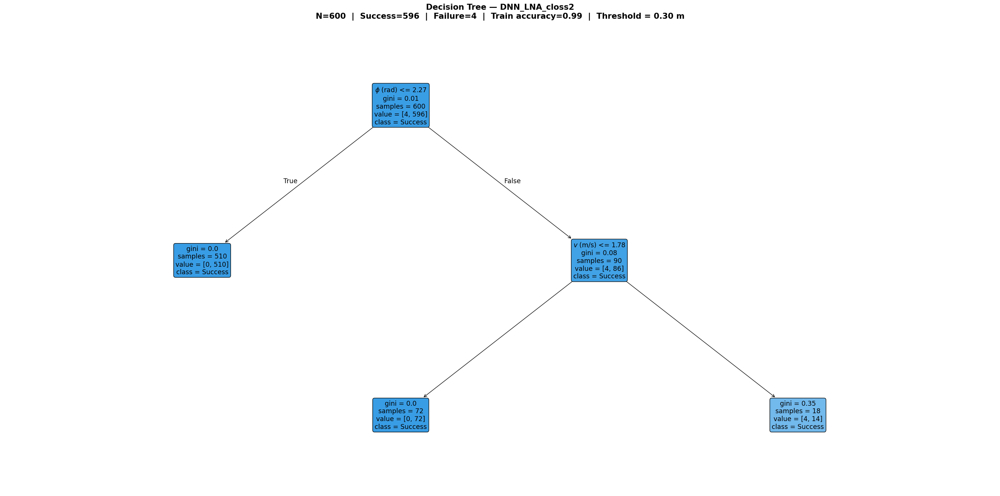

# SafeTraj-Experiments

**Trajectory-Level Evaluation of Neural Motion Prediction for Autonomous Wheelchair Navigation**

[](https://www.python.org/)
[](https://www.tensorflow.org/)
[](LICENSE)
[](https://rexasi-pro.spindoxlabs.com/)

---

**Author:** Pouya Bathaei Pourmand  
**Affiliation:** MSc in Computer Engineering (AI) — University of Genoa / CNR-IEIIT, Italy  
**Project:** [REXASI-PRO](https://rexasi-pro.spindoxlabs.com/) — Reliable & Explainable AI for Smart Mobility (EU Horizon Europe)  
**Supervisors:** Prof. Luca Oneto · Dr. Maurizio Mongelli · Dr. Sara Narteni

---

## Overview

This repository contains the public results and source code from the MSc thesis:

> **"Analysis of Neural Trajectory Prediction for Collision Avoidance in Smart Wheelchairs"**

The thesis develops a **systematic trajectory-level evaluation framework** for pretrained neural motion prediction models (DNN-LNA) used in autonomous wheelchair navigation.

The core question is: **when and why do neural trajectory predictors fail?**

All five models are treated as **black-box predictors** — evaluated purely through their outputs, without any access to weights or retraining.

> ⚠️ The DNN-LNA model weights are **not included** (proprietary, REXASI-PRO project). Only derived results, CSVs and visualisations are public.

---

## Problem Setting

Each navigation scenario is defined by three input commands:

| Symbol | Variable | Operational Range |
|--------|----------|-------------------|
| φ (theta) | Initial orientation | [−π, π] rad |
| v | Linear velocity | [−1.05, 2.88] m/s |
| ω (omega) | Angular velocity | [−1.99, 1.99] rad/s |

Given these inputs, a pretrained neural model predicts a future trajectory:

```
X̂ = f_θ(φ, v, ω) = [(x₁,y₁,θ₁), ..., (x_T, y_T, θ_T)]    T = 30 steps
```

A trajectory is evaluated using two criteria:

- **Strict success:** final distance to goal `d < 0.30 m`
- **Soft success:** Success (`d < 0.30 m`) / Near-success (`0.30 ≤ d < 0.50 m`) / Failure (`d ≥ 0.50 m`)

---

## Model Performance Summary

Strict success rate across all five models and three goal configurations (N=200 × 3 goals = 600 observations per model):



---

## Experiments

### Experiment 1 — Input-Space Sensitivity Analysis

**Objective:** Identify which command regions trigger failed trajectory predictions.

**Method:** N=200 inputs sampled uniformly across the operational range (φ, v, ω). Each of the five models generates a predicted trajectory per input. Outcomes are labelled as Success (`d < 0.30 m`) or Failure (`d ≥ 0.30 m`) and aggregated into risk maps over the input space.

**Key findings:**
- Initial orientation φ near ±π (wheelchair facing backward) is the dominant failure trigger
- Angular velocity ω has secondary influence
- Clear *zones of exclusion* exist in the command space — inputs that consistently produce failed trajectories regardless of goal

**3D Failure Zone Map — Orientation × Velocity × Final Distance (DNN_LNA_on_wheel1, Goal: (1.0, 0.0)):**

The figure below shows N=200 samples plotted in a 3D space defined by initial orientation φ, linear velocity v, and final distance to goal. Each point is coloured green (success) or red (failure). The gray horizontal plane marks the strict success threshold at d=0.30 m — all red points above this plane are failures. The red dashed lines mark the danger zone at φ ≈ ±π, where the wheelchair faces away from the goal and prediction failures consistently accumulate.



**Initial orientation vs. final distance to goal (all models and goals combined):**

The scatter plot below confirms the pattern across all five models: failures (points above the d=0.30 m threshold line) are heavily concentrated at extreme orientations near ±π, while the central orientation range produces reliable trajectories.



---

### Experiment 2 — Goal-Based Difficulty Analysis

**Objective:** Evaluate how model performance changes across different target positions.

**Method:** Three reference goals tested across all five models with strict and soft success criteria.

| Goal | Position | Complexity |
|------|----------|------------|
| A | (0.5, 0.5) | Near lateral — low/medium |
| B | (1.0, 0.0) | Straight ahead — medium |
| C | (1.5, −0.5) | Far off-axis — high |

**Key findings:**
- `DNN_LNA_closs2` achieves **99.3%** strict success across all goals
- `DNN_LNA_closs1` achieves only **25.3%** strict success
- Goal difficulty varies significantly — off-axis and far goals expose the largest model differences

**Goal difficulty map (average strict success rate over all models):**

The heatmap below shows the average success rate per goal configuration, averaged across all five models. Darker cells indicate harder goals where neural predictors fail more frequently. Goal C (1.5, −0.5) — the farthest off-axis target — is consistently the most challenging.


---

## Interpretability — Decision Tree Analysis

A shallow decision tree (max depth 4) was fitted per model on the
(φ, v, ω, GoalX, GoalY) → Success/Failure labels, revealing human-readable
rules for when each model fails.

**Best model — DNN_LNA_closs2 (99.3% success):** the tree has only 3 leaves, all
predicting Success. This confirms near-universal reliability across the entire input
space — the model succeeds for almost any combination of orientation, velocity, and goal.



> Full decision trees for all five models are available in [`results/figures/`](results/figures/).

---

## Practical Implications for Collision Avoidance

The identified risk regions support three concrete run-time applications:

1. **Dynamic Command Filtering** — Commands in high-risk regions (φ near ±π) can be proactively redirected before execution.
2. **Hybrid Navigation Fallback** — When the target lies in a high-failure region, the system switches to a classical model-based planner.
3. **Predictive Failure Monitoring** — Drift into the near-success zone triggers haptic or visual feedback to the user.

---

## Repository Structure

```
SafeTraj-Experiments/
│
├── src/
│   ├── config.py             # Central configuration (ranges, goals, thresholds)
│   ├── model_utils.py        # Model loading and inference interface
│   └── evaluate.py           # Main evaluation pipeline (Exp1 + Exp2)
│
├── results/
│   ├── figures/              # Model-level results (tables + decision trees)
│   ├── figures_exp1/         # Experiment 1 visualisations
│   ├── figures_exp2/         # Experiment 2 visualisations
│   └── tables/               # CSV outputs
│
├── requirements.txt
├── LICENSE
└── README.md
```

---

## Reproducing the Results

> The DNN-LNA model weights are not publicly available. To reproduce:
> 1. Obtain model weights from the [REXASI-PRO project](https://rexasi-pro.spindoxlabs.com/)
> 2. Place each model under `models/<model_name>/DNN_LNA_model/`
> 3. Run the pipeline:

```bash
pip install -r requirements.txt
python src/evaluate.py --model_root /path/to/models --output_dir results/
```

---

## Related Projects

**[SafeTraj-Prototype](https://github.com/pouyapd/SafeTraj-Prototype)** — A personal open-source Python toolkit for trajectory behaviour analysis and risk scoring of neural motion predictors. Includes an interactive Streamlit dashboard, risk estimation, and an LLM-based safety reporting module. Developed independently to extend and complement the analysis in this thesis.

---

## Citation

```bibtex
@mastersthesis{bathaei2026safetraj,
  author  = {Bathaei Pourmand, Pouya},
  title   = {Analysis of Neural Trajectory Prediction for Collision Avoidance
             in Smart Wheelchairs},
  school  = {University of Genoa, DIBRIS},
  year    = {2026},
  note    = {MSc in Computer Engineering (AI), REXASI-PRO EU Project}
}
```

---

## License

MIT — see [LICENSE](LICENSE) for details.  
Model weights are proprietary to the REXASI-PRO project and are not covered by this license.